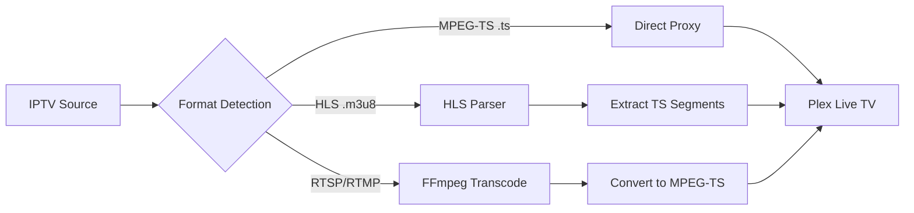
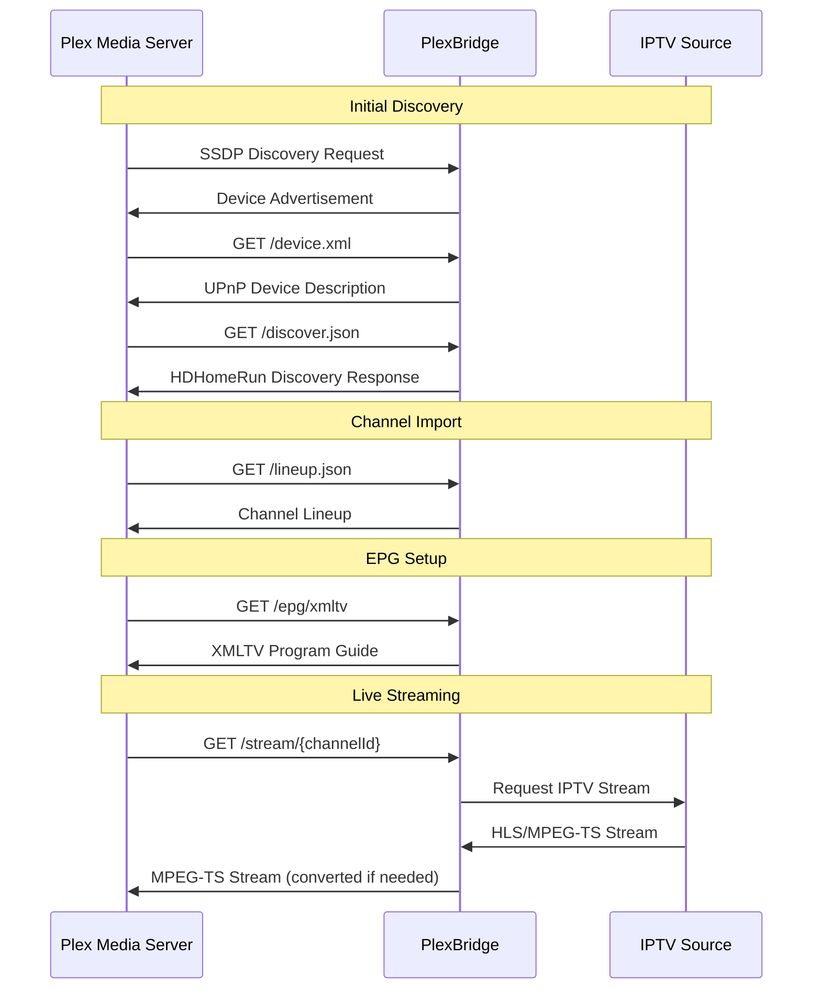

# PlexBridge - Plex Live TV Integration Guide

## Overview

PlexBridge acts as an **HDHomeRun network tuner emulator** that allows Plex Media Server to access IPTV streams as if they were traditional over-the-air television channels. This integration enables Plex Live TV functionality with any IPTV source, complete with Electronic Program Guide (EPG) support and DVR capabilities.

## Table of Contents

- [How HDHomeRun Emulation Works](#how-hdhomerun-emulation-works)
- [Plex Discovery Process](#plex-discovery-process)
- [API Endpoints](#api-endpoints)
- [Stream Format Requirements](#stream-format-requirements)
- [Electronic Program Guide (EPG)](#electronic-program-guide-epg)
- [Network Architecture](#network-architecture)
- [Configuration Guide](#configuration-guide)
- [Troubleshooting](#troubleshooting)

## How HDHomeRun Emulation Works

### HDHomeRun Protocol Overview

HDHomeRun devices are network-attached TV tuners that use standardized protocols for device discovery and stream delivery. PlexBridge implements these protocols to appear as a legitimate HDHomeRun device to Plex Media Server.

### Key Components

1. **SSDP/UPnP Discovery Service** - Broadcasts device presence on the network
2. **HTTP API Server** - Provides device information and channel lineup
3. **Stream Proxy** - Serves live video streams in the correct format
4. **EPG Integration** - Provides program guide data in XMLTV format

### Device Emulation Details

PlexBridge emulates a **SiliconDust HDHomeRun CONNECT** device with the following characteristics:

```javascript
{
  "FriendlyName": "PlexBridge HDHomeRun",
  "ModelNumber": "HDHR4-2US",
  "FirmwareName": "hdhomerun4_atsc",
  "FirmwareVersion": "20200907",
  "DeviceID": "PLEXTV001",
  "DeviceAuth": "PlexBridge",
  "TunerCount": 3,
  "BaseURL": "http://192.168.1.100:8080"
}
```

## Plex Discovery Process

### Step 1: SSDP Discovery

When Plex scans for HDHomeRun devices, PlexBridge responds with SSDP (Simple Service Discovery Protocol) broadcasts:

```
NOTIFY * HTTP/1.1
HOST: 239.255.255.250:1900
CACHE-CONTROL: max-age=86400
LOCATION: http://192.168.1.100:8080/device.xml
SERVER: Linux/3.14.0 UPnP/1.0 IpBridge/1.17.0
NTS: ssdp:alive
USN: uuid:2f402f80-da50-11e1-9b23-001788255acc
NT: upnp:rootdevice
```

### Step 2: Device Description

Plex requests the device description from `/device.xml`:

```xml
<?xml version="1.0"?>
<root xmlns="urn:schemas-upnp-org:device-1-0">
    <device>
        <deviceType>urn:schemas-upnp-org:device:MediaServer:1</deviceType>
        <friendlyName>PlexBridge HDHomeRun</friendlyName>
        <manufacturer>Silicondust</manufacturer>
        <modelName>HDHR4-2US</modelName>
        <modelNumber>HDHR4-2US</modelNumber>
        <UDN>uuid:2f402f80-da50-11e1-9b23-001788255acc</UDN>
    </device>
</root>
```

### Step 3: Discovery API Verification

Plex validates the device by calling `/discover.json`:

```json
{
  "FriendlyName": "PlexBridge HDHomeRun",
  "ModelNumber": "HDHR4-2US",
  "FirmwareName": "hdhomerun4_atsc",
  "FirmwareVersion": "20200907",
  "DeviceID": "PLEXTV001",
  "DeviceAuth": "PlexBridge",
  "TunerCount": 3,
  "BaseURL": "http://192.168.1.100:8080",
  "LineupURL": "http://192.168.1.100:8080/lineup.json"
}
```

### Step 4: Channel Lineup Import

Plex retrieves the channel lineup from `/lineup.json`:

```json
[
  {
    "GuideNumber": "1",
    "GuideName": "HGTV",
    "URL": "http://192.168.1.100:8080/stream/1",
    "HD": 1,
    "DRM": 0,
    "Favorite": 0
  },
  {
    "GuideNumber": "2", 
    "GuideName": "CNN Headlines",
    "URL": "http://192.168.1.100:8080/stream/2",
    "HD": 1,
    "DRM": 0,
    "Favorite": 0
  }
]
```

## API Endpoints

### Discovery Endpoints

| Endpoint | Method | Purpose | Plex Usage |
|----------|--------|---------|------------|
| `/device.xml` | GET | UPnP device description | Initial device validation |
| `/discover.json` | GET | HDHomeRun discovery API | Device capabilities check |
| `/lineup.json` | GET | Channel lineup | Channel import |
| `/lineup_status.json` | GET | Tuner status | Real-time tuner monitoring |

### Stream Endpoints

| Endpoint | Method | Purpose | Format |
|----------|--------|---------|--------|
| `/stream/{channelId}` | GET | Live stream for Plex | MPEG-TS |
| `/streams/preview/{streamId}` | GET | Browser preview | HLS/MP4 |
| `/epg/xmltv` | GET | Program guide | XMLTV |

### Implementation Example

```javascript
// Channel lineup generation (server/routes/ssdp.js)
app.get('/lineup.json', async (req, res) => {
  try {
    const channels = await database.all(`
      SELECT c.id, c.name, c.number, c.enabled,
             s.url, s.type
      FROM channels c
      LEFT JOIN streams s ON c.id = s.channel_id
      WHERE c.enabled = 1
      ORDER BY c.number
    `);

    const lineup = channels.map(channel => ({
      GuideNumber: channel.number.toString(),
      GuideName: channel.name,
      URL: `${baseUrl}/stream/${channel.id}`,
      HD: 1,
      DRM: 0,
      Favorite: 0
    }));

    res.json(lineup);
  } catch (error) {
    logger.error('Error generating lineup:', error);
    res.status(500).json({ error: 'Failed to generate lineup' });
  }
});
```

## Stream Format Requirements

### Plex Live TV Format Expectations

Plex expects **MPEG Transport Stream (MPEG-TS)** format from HDHomeRun devices, not HLS or MP4. This is critical for proper Plex DVR functionality.

#### Format Specifications

- **Container**: MPEG-TS (.ts)
- **Video Codec**: H.264 (AVC)
- **Audio Codec**: AAC or AC-3
- **Content-Type**: `video/mp2t`
- **Streaming Method**: HTTP Progressive Download

#### Implementation Details

```javascript
// Stream proxy for Plex (server/services/streamManager.js)
async proxyStream(streamUrl, req, res) {
  // Set MPEG-TS content type for Plex compatibility
  res.setHeader('Content-Type', 'video/mp2t');
  res.setHeader('Access-Control-Allow-Origin', '*');
  res.setHeader('Cache-Control', 'no-cache');

  // For HLS sources, extract and serve the TS segments
  if (streamUrl.includes('.m3u8')) {
    await this.proxyHLSAsTS(streamUrl, req, res);
  } else {
    // Direct proxy for MPEG-TS sources
    await this.directProxy(streamUrl, req, res);
  }
}
```

### Format Conversion Pipeline



## Electronic Program Guide (EPG)

### XMLTV Integration

PlexBridge supports XMLTV format for Electronic Program Guide data, which Plex uses for program information and DVR scheduling.

#### EPG Endpoint

```
GET /epg/xmltv
Content-Type: application/xml

Returns XMLTV format data for all channels
```

#### XMLTV Structure

```xml
<?xml version="1.0" encoding="UTF-8"?>
<tv generator-info-name="PlexBridge" generator-info-url="https://github.com/user/plexbridge">
  <channel id="hgtv.us">
    <display-name>HGTV</display-name>
    <icon src="https://example.com/logos/hgtv.png"/>
  </channel>
  <programme start="20250819120000 +0000" stop="20250819130000 +0000" channel="hgtv.us">
    <title>Property Brothers</title>
    <desc>Home renovation reality series.</desc>
    <category>Reality</category>
  </programme>
</tv>
```

#### Configuration in Plex

1. Navigate to **Settings → Live TV & DVR**
2. Select your PlexBridge tuner
3. Set **Program Guide** to: `http://192.168.1.100:8080/epg/xmltv`
4. Configure refresh interval (recommended: 4 hours)

## Network Architecture

### Communication Flow



### Network Requirements

- **Port 8080**: HTTP API and streaming (configurable)
- **Port 1900**: SSDP/UPnP discovery (UDP)
- **Multicast**: 239.255.255.250 for SSDP broadcasts
- **Same Network**: Plex and PlexBridge must be on the same subnet

### Firewall Configuration

```bash
# Allow PlexBridge HTTP traffic
iptables -A INPUT -p tcp --dport 8080 -j ACCEPT

# Allow SSDP discovery
iptables -A INPUT -p udp --dport 1900 -j ACCEPT
iptables -A OUTPUT -p udp --dport 1900 -j ACCEPT

# Allow multicast for SSDP
iptables -A INPUT -d 239.255.255.250 -j ACCEPT
iptables -A OUTPUT -d 239.255.255.250 -j ACCEPT
```

## Configuration Guide

### Step 1: Initial Setup

1. **Start PlexBridge**:
   ```bash
   npm run dev
   ```

2. **Verify Discovery**:
   ```bash
   curl http://localhost:8080/discover.json
   ```

3. **Check Channel Lineup**:
   ```bash
   curl http://localhost:8080/lineup.json
   ```

### Step 2: Plex Configuration

1. **Open Plex Media Server** (http://plex-server-ip:32400/web)

2. **Navigate to Live TV & DVR**:
   - Settings → Live TV & DVR
   - Set up → DVR → HDHomeRun

3. **Device Discovery**:
   - Plex should automatically discover "PlexBridge HDHomeRun"
   - If not found, manually enter: `http://plexbridge-ip:8080`

4. **Channel Scan**:
   - Select all desired channels
   - Configure channel mapping if needed

5. **EPG Configuration**:
   - Program Guide: `http://plexbridge-ip:8080/epg/xmltv`
   - Refresh Interval: 4 hours (recommended)

### Step 3: Testing

1. **Test Live TV**:
   - Open Plex client
   - Navigate to Live TV
   - Verify channels load and play correctly

2. **Test DVR**:
   - Schedule a recording
   - Verify recording starts and stops properly
   - Check recording quality and format

### Advanced Configuration

#### Custom User Agent

Some IPTV sources require specific user agents:

```javascript
// In stream configuration
{
  "headers": {
    "User-Agent": "Mozilla/5.0 (Windows NT 10.0; Win64; x64) AppleWebKit/537.36"
  }
}
```

#### Stream Authentication

For protected IPTV sources:

```javascript
{
  "auth_username": "your_username",
  "auth_password": "your_password"
}
```

#### Quality Profiles

Configure transcoding for different clients:

```javascript
{
  "transcode_profiles": {
    "plex": {
      "video_codec": "libx264",
      "audio_codec": "aac",
      "video_bitrate": "4000k",
      "audio_bitrate": "128k"
    }
  }
}
```

## Troubleshooting

### Common Issues

#### 1. Plex Cannot Discover PlexBridge

**Symptoms**:
- PlexBridge not appearing in Plex tuner list
- Manual IP entry fails

**Solutions**:
```bash
# Check SSDP service
curl -I http://localhost:8080/device.xml

# Verify network connectivity
ping plexbridge-ip

# Check firewall rules
sudo iptables -L | grep 8080
sudo iptables -L | grep 1900

# Restart SSDP service
systemctl restart plexbridge
```

#### 2. Channels Import but Don't Play

**Symptoms**:
- Channels appear in Plex but fail to stream
- "Tuner not available" errors

**Solutions**:
```bash
# Test stream endpoints directly
curl -I http://localhost:8080/stream/1

# Check IPTV source connectivity
curl -I https://iptv-source.com/stream.m3u8

# Verify format conversion
ffprobe http://localhost:8080/stream/1
```

#### 3. EPG Data Not Loading

**Symptoms**:
- No program guide information
- Missing show descriptions

**Solutions**:
```bash
# Test EPG endpoint
curl http://localhost:8080/epg/xmltv

# Verify XMLTV format
xmllint --noout http://localhost:8080/epg/xmltv

# Check EPG refresh logs
tail -f logs/app.log | grep EPG
```

#### 4. Poor Stream Quality or Buffering

**Symptoms**:
- Pixelated video
- Frequent buffering
- Audio/video sync issues

**Solutions**:
1. **Enable Transcoding**:
   ```
   http://localhost:8080/stream/1?transcode=true&quality=medium
   ```

2. **Adjust Buffer Settings**:
   ```javascript
   // In streamManager.js
   "buffer_size": "32768",
   "read_timeout": "10000"
   ```

3. **Optimize Network**:
   - Use wired connection for PlexBridge
   - Ensure sufficient bandwidth (10+ Mbps per stream)
   - Consider dedicated IPTV VLAN

### Diagnostic Commands

```bash
# Check PlexBridge status
curl http://localhost:8080/health

# Monitor active streams
curl http://localhost:8080/api/streams/active

# View system metrics
curl http://localhost:8080/api/metrics

# Test SSDP broadcast
nmap -sU -p 1900 --script upnp-info 192.168.1.0/24

# Analyze stream format
ffprobe -v quiet -print_format json -show_format -show_streams http://localhost:8080/stream/1
```

### Log Analysis

```bash
# View PlexBridge logs
tail -f data/logs/app-$(date +%Y-%m-%d).log

# Filter for Plex-related entries
grep -i "plex\|hdhomerun\|tuner" data/logs/app-$(date +%Y-%m-%d).log

# Monitor stream requests
grep "GET /stream/" data/logs/app-$(date +%Y-%m-%d).log

# Check SSDP activity
tcpdump -i eth0 port 1900
```

### Performance Optimization

#### System Requirements

- **CPU**: Multi-core processor (transcoding intensive)
- **RAM**: 4GB minimum, 8GB recommended
- **Network**: Gigabit Ethernet preferred
- **Storage**: SSD for optimal database performance

#### Tuning Parameters

```javascript
// In config/default.json
{
  "streams": {
    "concurrent_limit": 3,
    "transcode_timeout": 30000,
    "buffer_size": 65536
  },
  "cache": {
    "ttl": {
      "streams": 300,
      "epg": 3600
    }
  }
}
```

## Conclusion

PlexBridge successfully emulates an HDHomeRun network tuner by implementing the complete HDHomeRun protocol stack:

1. **SSDP/UPnP Discovery** - Allows Plex to find the device
2. **REST API Endpoints** - Provides device info and channel lineup  
3. **MPEG-TS Stream Serving** - Delivers live video in Plex-compatible format
4. **XMLTV EPG Integration** - Supplies program guide data

This architecture enables Plex Media Server to treat any IPTV source as a traditional over-the-air tuner, unlocking full Live TV and DVR functionality with complete channel management, program guides, and recording capabilities.

For additional support and advanced configuration options, refer to the main PlexBridge documentation and configuration examples in the `/config` directory.