# EPG Production Test Results Summary

## Executive Summary

Comprehensive Playwright tests have been executed against the PlexBridge production system at **192.168.3.148:3000** to verify EPG functionality, with specific focus on the FreeviewNEW source that was experiencing issues. The tests successfully identified the root cause of the problems and documented the current system status.

---

## 🎯 Key Findings

### ✅ **What's Working**
1. **EPG Management Interface**: Fully functional with 19 EPG sources detected
2. **API Endpoints**: All EPG APIs responding with 200 status codes
3. **Data Volume**: 66,437 total programs across 49/49 mapped channels
4. **FreeviewNEW Source Present**: Source is configured and visible in interface
5. **Manual Refresh Mechanism**: Refresh buttons and API calls functional

### ❌ **Critical Issues Identified**

#### 1. **FreeviewNEW Data Storage Problem**
**Status**: 🚨 **CRITICAL ERROR**
```
Error: "VERIFICATION FAILED: Parsed 6171 programs but none found in database after storage"
```
- **Root Cause**: FreeviewNEW successfully downloads and parses 6,171 programs but they fail to persist to database
- **Impact**: No FreeviewNEW channels available for association with streams
- **Evidence**: API calls show 0 FreeviewNEW channels in `/api/epg/channels` endpoint

#### 2. **Manual Refresh Failures**
**Status**: ❌ **FAILING**
```
API Response: 500 Internal Server Error
Console Error: "Server error: Failed to refresh EPG"
```
- **Impact**: Manual EPG refresh operations fail with 500 errors
- **Evidence**: POST to `/api/epg/refresh` returns 500 status

#### 3. **Channel Association Broken**
**Status**: ❌ **NO CHANNELS AVAILABLE**
- **Finding**: Channel association dropdowns contain 0 FreeviewNEW channels
- **Impact**: Users cannot associate streams with FreeviewNEW EPG data
- **Root Cause**: Linked to data storage issue above

---

## 📊 Detailed Test Results

### EPG Management Interface Testing
- **Status**: ✅ **PASSED**
- **EPG Sources Found**: 19 sources
- **Navigation**: Successfully found and navigated to EPG section
- **Interface Elements**: Refresh buttons (1), Add source buttons (1) detected
- **FreeviewNEW Visibility**: ✅ Source visible in management interface

### FreeviewNEW Source Configuration
- **Status**: ⚠️ **PARTIALLY WORKING**
- **Source URL**: `https://i.mjh.nz/nz/epg.xml`
- **Refresh Interval**: 4 hours
- **Last Refresh**: 2025-09-28 21:24:15
- **Last Success**: 2025-09-28 08:31:03 (13+ hours ago)
- **Current Error**: Data parsing succeeds, storage fails

### API Endpoint Status
| Endpoint | Status | Response | Data Quality |
|----------|--------|----------|--------------|
| `/api/epg/sources` | ✅ 200 | 18 sources | Valid JSON |
| `/api/epg/programs` | ✅ 200 | 1,000 records | Valid JSON |
| `/api/epg/channels` | ✅ 200 | 49 channels | Valid JSON |
| `/api/epg/refresh` | ❌ 500 | Server Error | Failed |
| `/api/epg/xmltv` | ✅ 200 | Valid XML | Valid XML |

### Channel Association Testing
- **Status**: ❌ **FAILED**
- **Association Elements Found**: 1 mapping interface
- **FreeviewNEW Channels**: 0 available in dropdowns
- **Expected**: Should show New Zealand Freeview channels
- **Actual**: Empty dropdown, no channels available

### Data Quality Analysis
- **Total Programs**: 66,437 across all sources
- **FreeviewNEW Programs**: 0 (due to storage failure)
- **Other Sources**: Working correctly (Brisbane XMLTV, ESPN, Fox Sports, etc.)
- **Channel Mapping Efficiency**: 100% for non-FreeviewNEW sources

---

## 🔍 Technical Analysis

### FreeviewNEW Data Flow Issue

```mermaid
graph TD
    A[FreeviewNEW XML Source] --> B[Download: ✅ SUCCESS]
    B --> C[Parse: ✅ SUCCESS - 6,171 programs]
    C --> D[Database Storage: ❌ FAILED]
    D --> E[Verification: ❌ FAILED - 0 programs found]
    E --> F[Channel Association: ❌ EMPTY]
```



### Error Timeline
1. **08:31:03** - Last successful FreeviewNEW data storage
2. **21:24:15** - Latest refresh attempt
3. **Current Status** - 13+ hours without successful data storage

### Console Error Messages
```
Failed to load resource: the server responded with a status of 500 (Internal Server Error)
Server error: Failed to refresh EPG
```

### Network Analysis
- **WebSocket Connections**: Some connection issues detected
- **EPG API Calls**: Working for read operations, failing for refresh operations
- **Data Transfer**: Download successful, storage operation failing

---

## 📸 Visual Evidence

### Generated Screenshots (30 total)

#### EPG Interface Documentation
- `epg-prod-01-homepage.png` - Initial system state
- `epg-prod-02-interface-initial.png` - EPG management interface
- `epg-prod-04-before-refresh.png` - Pre-refresh state
- `epg-prod-05-after-refresh.png` - Post-refresh state
- `epg-prod-06-refresh-analysis.png` - Detailed refresh analysis

#### FreeviewNEW Specific Testing
- `freeview-01-epg-initial.png` - Initial EPG state
- `freeview-02-source-highlighted.png` - FreeviewNEW source highlighted
- `freeview-03-before-refresh.png` - Before refresh attempt
- `freeview-04-after-refresh.png` - After refresh (with errors)
- `freeview-05-refresh-analysis.png` - Detailed error analysis

#### Channel Association Evidence
- `freeview-08-mapping-interface.png` - Channel mapping interface
- `freeview-10-mapping-analysis.png` - Association analysis
- `epg-prod-08-channel-association.png` - Association dropdown testing

#### Error Documentation
- `epg-prod-15-error-analysis.png` - Comprehensive error analysis
- `freeview-12-data-validation.png` - Data validation results

#### Mobile Responsive Testing
- `epg-prod-13-mobile-display.png` - Mobile interface verification

---

## 🛠️ Recommendations

### Immediate Actions Required

#### 1. **Fix FreeviewNEW Database Storage**
**Priority**: 🚨 **CRITICAL**
- **Action**: Investigate database storage mechanism for FreeviewNEW data
- **Focus**: Storage transaction failing after successful parsing
- **Check**: Database constraints, data validation, transaction rollbacks
- **Timeline**: Immediate (production issue)

#### 2. **Resolve Manual Refresh Errors**
**Priority**: 🔴 **HIGH**
- **Action**: Debug 500 error in `/api/epg/refresh` endpoint
- **Check**: Server logs, error handling, resource constraints
- **Impact**: Users cannot manually refresh EPG data

#### 3. **Verify Database Integrity**
**Priority**: 🔴 **HIGH**
- **Action**: Check for database corruption or constraint violations
- **Investigate**: Why other sources work but FreeviewNEW fails
- **Tools**: Database integrity checks, transaction logs

### Technical Investigation Steps

#### 1. **Server-Side Debugging**
```bash
# Check server logs for FreeviewNEW errors
tail -f /var/log/plexbridge/app.log | grep -i freeview

# Check database constraints
sqlite3 plextv.db ".schema"

# Verify storage transaction
sqlite3 plextv.db "SELECT COUNT(*) FROM programs WHERE source_name='FreeviewNEW';"
```

#### 2. **Manual Data Verification**
```bash
# Test FreeviewNEW XML source directly
curl -I "https://i.mjh.nz/nz/epg.xml"

# Check API responses
curl "http://192.168.3.148:3000/api/epg/programs?source=FreeviewNEW"
```

#### 3. **Database Analysis**
- Check for foreign key constraint violations
- Verify channel mapping table integrity
- Check for duplicate key conflicts
- Analyze transaction rollback reasons

### Long-term Improvements

#### 1. **Enhanced Error Handling**
- Add detailed error logging for failed EPG storage
- Implement transaction rollback analysis
- Add data validation checkpoints

#### 2. **Monitoring & Alerting**
- Add alerts for EPG refresh failures
- Monitor data storage success rates
- Track per-source success/failure metrics

#### 3. **Data Recovery**
- Implement automatic retry mechanisms
- Add manual data repair tools
- Create backup/restore procedures for EPG data

---

## 🧪 Test Suite Value

### Tests Successfully Identified
1. **Root Cause**: FreeviewNEW data storage failure (not download/parsing)
2. **User Impact**: Channel association completely broken for FreeviewNEW
3. **System Status**: Other EPG sources working normally
4. **API Health**: Read operations working, write operations failing

### Test Coverage Achieved
- ✅ Interface navigation and usability
- ✅ EPG source management functionality
- ✅ Manual refresh workflow testing
- ✅ Channel association verification
- ✅ Error state identification
- ✅ API endpoint validation
- ✅ Mobile responsive design
- ✅ Visual regression documentation

### Production Monitoring Value
- **Automated Detection**: Tests can run on schedule to detect similar issues
- **Visual Documentation**: Screenshots provide clear evidence for debugging
- **Performance Baseline**: Established normal operation benchmarks
- **Regression Prevention**: Tests will catch if fixes break other functionality

---

## 📋 Next Steps

### For Development Team
1. **Immediate**: Investigate FreeviewNEW database storage failure
2. **Short-term**: Fix manual refresh 500 errors
3. **Medium-term**: Implement enhanced error monitoring
4. **Long-term**: Add automated EPG health checks

### For Operations Team
1. **Monitor**: Database disk space and transaction logs
2. **Backup**: Current working EPG data before attempting fixes
3. **Notify**: Users that FreeviewNEW channels temporarily unavailable
4. **Schedule**: Regular automated testing using these test suites

### For Testing Team
1. **Run**: These tests daily to monitor EPG health
2. **Expand**: Add tests for other EPG sources if needed
3. **Monitor**: Test execution times and screenshot storage
4. **Report**: Weekly EPG functionality status reports

---

## 📞 Contact & Support

**Test Suite Created**: 2025-09-29
**Target Environment**: PlexBridge Production (192.168.3.148:3000)
**Test Framework**: Playwright with Chrome browser automation
**Screenshot Storage**: `/tests/screenshots/`
**Test Reports**: Available via `npx playwright show-report`

**For Technical Support**:
- Review generated screenshots for visual evidence
- Check test execution logs for detailed error information
- Use test runner: `node tests/run-production-epg-tests.js`
- Access HTML reports at: `http://localhost:9323`

---

*This report was generated from comprehensive Playwright testing of the PlexBridge EPG system. All findings are based on automated browser testing with visual verification and API endpoint validation.*